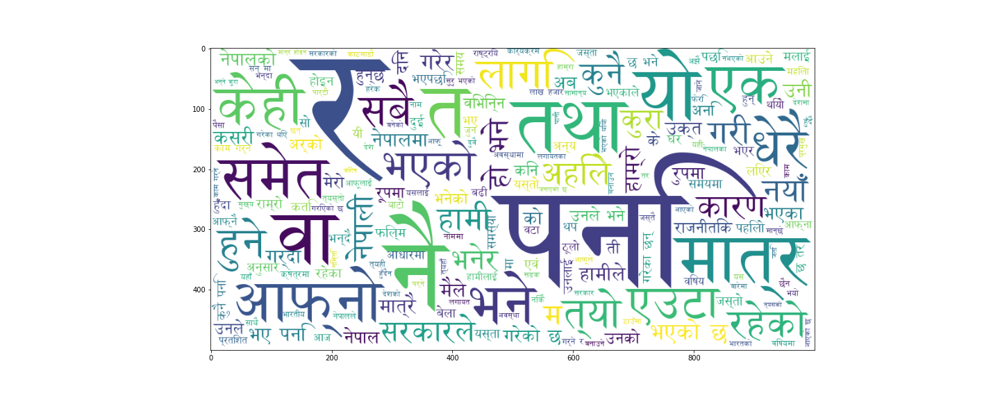

# Nepali Language Processing

## Proposal and Report Links
* [Proposal](https://github.com/NirajanBekoju/Nepali-Language-Processing-Proposal/blob/master/main.pdf)

## Project Goals

* To develop nepali language model using probabilistic and sequential model.
* Explore the areas of word embeddings and classification of nepali texts.
* Develop a spelling correction model of nepali texts

## File Structures
* Classification : Classification of nepali movies review and nepali sentimental classification
* Probabilistic Language Model : N_gram language model of nepali texts
* Word Embedding : Word Cloud and Nepali word embedding using gensim Word2Vec model

## Status 
* Currently working on.
